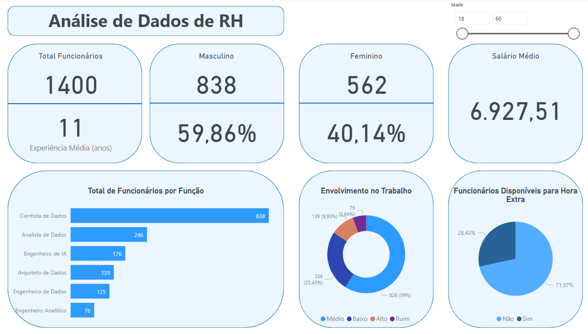

# Dashboard Recursos Humanos
 

  

 

## Sobre o projeto
Esse dashboard foi construído com base nas perguntas que o setor de Recursos Humanos visava ter as respostas. Para isso foi utilizado DAX na construção de uma tabela com diversas medidas necessárias para tornar a performance do dashboard mais ágil, bem como garantir a integridade dos dados. Também foi inserido um botão de segmentação da idade dos funcionários para filtrar melhor as informações do painel e melhor atender as necessidades do setor. 

* **[Projeto na íntegra (disponível para download)](https://github.com/raffaloffredo/dashboard_rh/blob/main/dashboard_rh.pbix)**
 

Perguntas enviadas pelo setor de Recursos Humanos:
* Quantidade total de funcionários atualmente na empresa
* Qual o tempo médio de experiência dos funcionários (em anos)?
* Qual o total e o percentual de funcionários do gênero masculino e do gênero feminino?
* Qual a média salarial dos funcionários (por mês)?
* Qual o total de funcionários por função?
* Qual o percentual de funcionários disponíveis para fazer hora extra?
* Qual o nível de envolvimento dos funcionários no trabalho, considerando 4 categorias: Ruim, Baixo, Médio e Alto?
 

## Material Extra
Os dados utilizados nesse projeto referem-se à uma empresa fictícia e também estão disponíveis para download.

* **[Dataset Recursos Humanos](https://github.com/raffaloffredo/dashboard_rh/blob/main/DatasetRH.csv)**
 

## Outros projetos

* **[Dashboard de Marketing](https://github.com/raffaloffredo/dashboard_marketing)**
* **[Dashboard de Vendas](https://github.com/raffaloffredo/dashboard_vendas)**
* **[Dashboard de Vendas Globais](https://github.com/raffaloffredo/dashboard_vendas_globais/)**
* **[Airbnb New York](https://github.com/raffaloffredo/airbnb_new_york_portuguese)**
* **[Estudo atualizado sobre COVID-19 no Brasil e no mundo](https://github.com/raffaloffredo/covid_2023_portuguese)**
* **[Detecção de fraude em cartão de crédito](https://github.com/raffaloffredo/fraud_detection_portuguese)**
 

 ## Contatos

  
  
  
  
  

